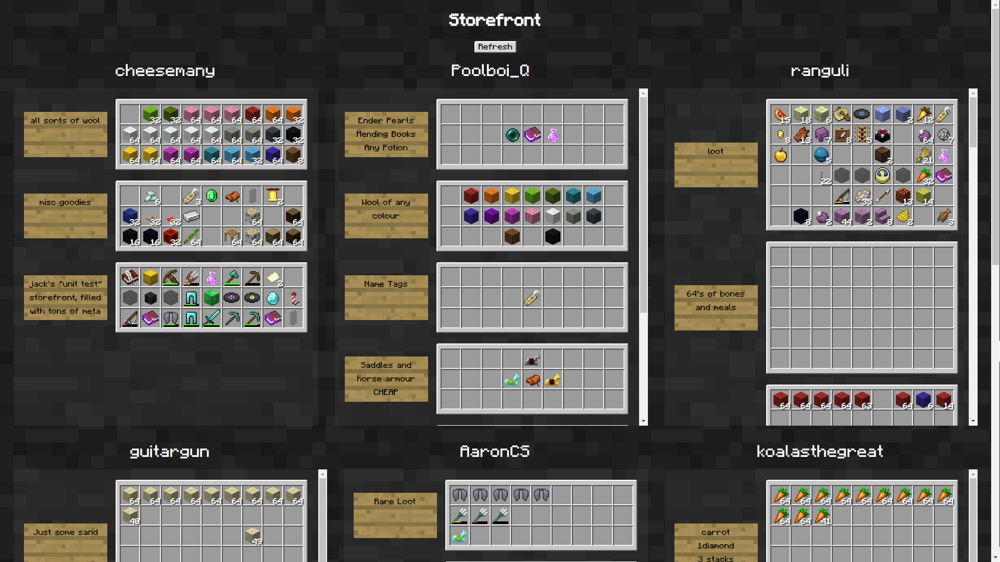

# Storefront

Place a chest in the world, put a sign on it, slap `[storefront]` on the first line, discuss your wares, and it's on a website!

The frontend Docker build accepts `--build-arg BASE_PATH=/storefront/` (default `/`).
When serving under a prefix, strip it at the reverse proxy before forwarding to
the frontend container. Set `API_PROXY_TARGET` to the plugin's HTTP address.

GitHub Actions publishes these images to GHCR on pushes to `main` and published
releases:

- `ghcr.io/jackharrhy/storefront-frontend:latest` serves at `/`.
- `ghcr.io/jackharrhy/storefront-frontend:latest-storefront` serves at `/storefront/`.
- `ghcr.io/jackharrhy/storefront-discord:latest` runs the Discord bot.

Images also get `sha-<full-commit-sha>` and release-tag versions, with a
`-storefront` suffix for the prefixed frontend. Pin deployments by digest;
`latest` follows `main`. Pull requests build without publishing.

Publishing uses the workflow's `GITHUB_TOKEN`, not Docker Hub credentials.
After the first publish, set each GHCR package's visibility to public if it
should be pullable without authentication.
