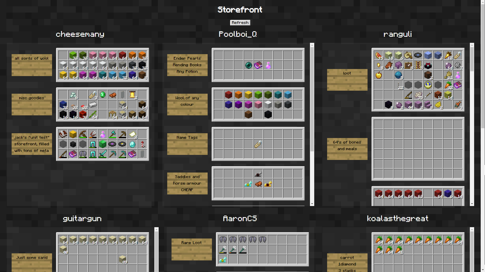

# Storefront

Place a chest in the world, put a sign on it, slap `[storefront]` on the first line, discuss your wares, and it's on a website!



The frontend Docker build accepts `--build-arg BASE_PATH=/storefront/` (default `/`).
When serving under a prefix, strip it at the reverse proxy before forwarding to
the frontend container. Set `API_PROXY_TARGET` to the plugin's HTTP address.

GitHub Actions publishes these images to GHCR on pushes to `main` and published
releases:

- `ghcr.io/jackharrhy/storefront-frontend:latest` serves at `/`.
- `ghcr.io/jackharrhy/storefront-frontend:latest-storefront` serves at `/storefront/`.
- `ghcr.io/jackharrhy/storefront-discord:latest` runs the Discord bot.

Images also get `sha-<full-commit-sha>` and release-tag versions, with a
`-storefront` suffix for the prefixed frontend. Pin deployments by digest;
`latest` follows `main`. Pull requests build without publishing.

Publishing uses the workflow's `GITHUB_TOKEN`, not Docker Hub credentials.
After the first publish, set each GHCR package's visibility to public if it
should be pullable without authentication.

## Paper and Fabric (Minecraft 26.2)

Both server artifacts require Java 25+; builds use Java 26.

- Paper: `./mvnw clean verify`, then install `target/storefront-2.0-SNAPSHOT.jar`
  in `plugins/`. Existing data and `plugins/Storefront/config.yml` are unchanged.
- Fabric: `./fabric/gradlew -p fabric build`, then install
  `fabric/build/libs/storefront-fabric-2.0-SNAPSHOT.jar` in `mods/` alongside
  Fabric API 0.161.0+26.2, with Fabric Loader 0.19.5. Do not install the `thin`
  or `smoke` JARs. No client mod is required.

Fabric uses `config/storefront/config.yml` and `config/storefront/storefront.db`.
The YAML accepts the same `web` and `refresh` settings as Paper. HTTP remains
read-only, bound to loopback by default; the existing frontend, icons and API
paths work unchanged. Sign creation/editing and owner right-clicks capture the
front text and complete single/double chest inventories. Only owners may edit
or break listing signs. Refreshes run every 2400 ticks, with the configured
capture budget; unloaded chunks (including either double-chest half) are skipped.
`storefrontforceupdate`, `forceupdate` and `storefrontrefreshstatus` require
Paper's `storefront.admin` permission or Fabric's vanilla administrator permission
(operator level 3). The development `storefrontcatalog` command is Paper-only.

### Importing Paper listings

Work on a verified stopped-server backup copy, never a running production world.
Copy the Storefront SQLite database and its WAL/SHM sidecars, if present, together
into Fabric's data directory; copy `config.yml` too. The schema, listing IDs,
owner UUIDs and saved JSON are retained. Set `worlds` aliases if the Paper world
names differ from `world`, `world_nether`, and `world_the_end`:

```yaml
worlds:
  minecraft:overworld: cheesetown
  minecraft:the_nether: cheesetown_nether
  minecraft:the_end: cheesetown_the_end
```

Unknown worlds remain untouched until explicitly mapped. A Fabric snapshot keeps
the item API shape; `meta.components` contains native item components and
`meta.internal` contains compressed item NBT. Existing Paper metadata remains
readable until that chest is refreshed. Plugin-specific custom-item behavior is
not recreated by preserving its NBT. World/dimension migration is separate:
follow [Paper's current migration guide](https://docs.papermc.io/paper/migration/)
on the backup copy before importing it. No automatic world conversion is performed.

See [the Fabric smoke test](dev/README.md#fabric-smoke-test) for isolated testing.
Feature-branch builds do not publish Docker images or release attachments.
